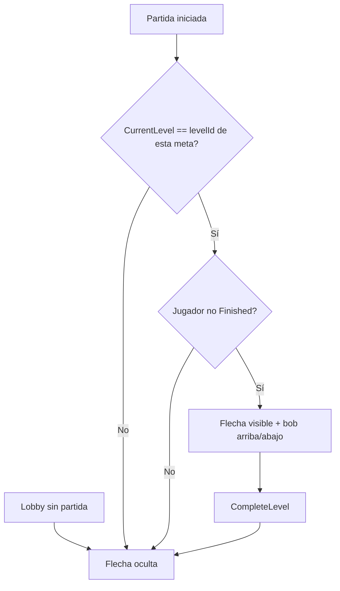

# Flecha flotante sobre la meta

## Contexto en el proyecto

- Hay **3 metas** en `[Juego.unity](Assets/Scenes/JuegoEscena/Juego.unity)`: `MetaNivel1`, `MetaNivel2`, `MetaNivel3`.
- Cada una tiene `[GoalTrigger](Assets/Scripts/escena1/GoalTrigger.cs)` con `_levelId` 1, 2 o 3 y un `BoxCollider` trigger.
- El jugador avanza de nivel en `[Player.CompleteLevel()](Assets/Scripts/escena1/Player.cs)` cuando `CurrentLevel == _levelId`.
- Ya existe un patrón de UI world-space + billboard en `[PlayerNameTag.cs](Assets/Scripts/escena1/PlayerNameTag.cs)` (`Canvas` world + `FusionBasicBillboard`).

## Comportamiento deseado




- **Solo una flecha visible** por jugador: la de su meta actual.
- **No visible** en lobby, en metas de otros niveles, ni tras terminar la carrera.
- **Animación**: oscilación vertical suave (sin networking; es puramente visual local).

---

## Implementación

### 1. Nuevo script `GoalMarkerIndicator.cs`

Archivo: `[Assets/Scripts/escena1/GoalMarkerIndicator.cs](Assets/Scripts/escena1/GoalMarkerIndicator.cs)`

Responsabilidades:

- `[SerializeField] int _levelId` — mismo id que el `GoalTrigger` del objeto padre.
- `[SerializeField] float _heightOffset = 3f` — altura sobre la meta.
- `[SerializeField] float _bobAmplitude = 0.25f` — recorrido vertical del bob.
- `[SerializeField] float _bobSpeed = 2f` — velocidad de la oscilación.
- `[SerializeField] Transform _visualRoot` — hijo donde vive la flecha (opcional; si null, usar `transform`).

En `LateUpdate()`:

```csharp
bool visible = GameManager.IsMatchStartedSafe
    && Player.Local != null
    && Player.Local.CurrentLevel == _levelId
    && Player.Local.State != EPlayerState.Finished;

gameObject.SetActive(visible);
if (!visible) return;

float bobY = _heightOffset + Mathf.Sin(Time.time * _bobSpeed) * _bobAmplitude;
_visualRoot.localPosition = new Vector3(0f, bobY, 0f);
```

- Crear visuals en `Awake()` si no están asignados (mismo enfoque que `PlayerNameTag.EnsureVisuals()`):
  - `Canvas` en **World Space** con escala pequeña (~0.02).
  - `FusionBasicBillboard` para que mire a la cámara.
  - `TextMeshProUGUI` con símbolo **↓** (o texto "META") en color llamativo (verde/amarillo).
  - Fondo semitransparente opcional para legibilidad.
- **No** usar `NetworkBehaviour`: no hace falta sincronizar; cada cliente decide según `Player.Local`.

### 2. Colocar el indicador en las 3 metas

Opción recomendada (mínima intervención en escena):

- Crear hijo vacío `GoalMarker` bajo cada `MetaNivel1/2/3`.
- Añadir `GoalMarkerIndicator` con el `_levelId` correspondiente.
- Posición local `(0, 0, 0)`; la altura la controla el script.

Para no editar manualmente la escena gigante, añadir tool de editor:

Archivo: `[Assets/Editor/GoalMarkerSetup.cs](Assets/Editor/GoalMarkerSetup.cs)`

- Menú: `Tools/Goal Marker/Setup en escena Juego`.
- Buscar objetos con `GoalTrigger` o nombre `MetaNivel`*.
- Si no tienen hijo `GoalMarker`, crearlo y añadir `GoalMarkerIndicator` con `_levelId` copiado del `GoalTrigger`.

### 3. Sin cambios en lógica de red

- No modificar `[GoalTrigger.cs](Assets/Scripts/escena1/GoalTrigger.cs)` ni `[Player.cs](Assets/Scripts/escena1/Player.cs)`.
- La flecha reacciona a `CurrentLevel` y `State` ya existentes.

---

## Verificación manual

1. Entrar al lobby → **ninguna flecha visible**.
2. Iniciar partida en nivel 1 → flecha sobre `MetaNivel1`, moviéndose suavemente arriba/abajo.
3. Llegar a la meta 1 → flecha desaparece; al teleport al nivel 2, aparece sobre `MetaNivel2`.
4. Terminar carrera (`Finished`) → ninguna flecha.
5. Cliente en multijugador: cada uno ve la flecha de **su** nivel actual, no la de otros.

---

## Archivos a crear/modificar


| Archivo                                                                   | Acción                                                       |
| ------------------------------------------------------------------------- | ------------------------------------------------------------ |
| `[GoalMarkerIndicator.cs](Assets/Scripts/escena1/GoalMarkerIndicator.cs)` | Crear                                                        |
| `[GoalMarkerSetup.cs](Assets/Editor/GoalMarkerSetup.cs)`                  | Crear (setup en escena)                                      |
| `[Juego.unity](Assets/Scenes/JuegoEscena/Juego.unity)`                    | Añadir hijos `GoalMarker` en las 3 metas (vía tool o manual) |


No se requieren assets externos; la flecha puede ser TMP `↓` con billboard, reutilizando el patrón de `PlayerNameTag`.